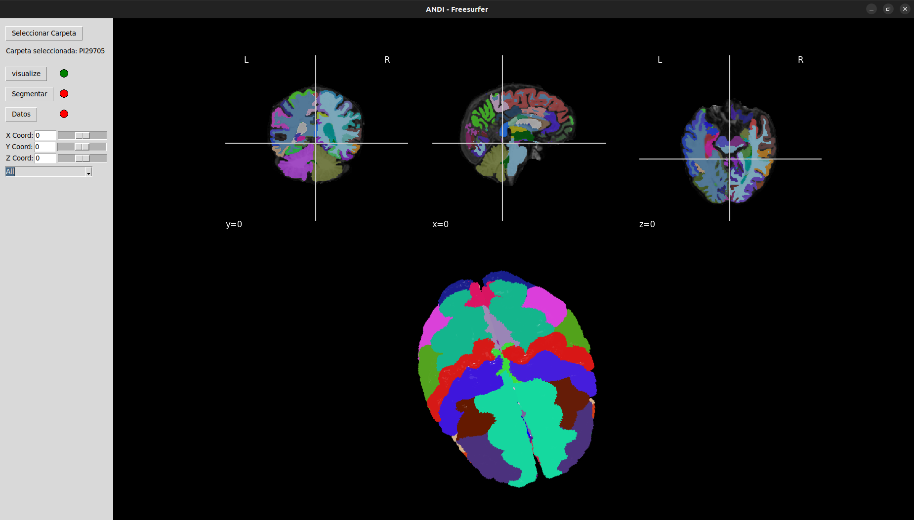
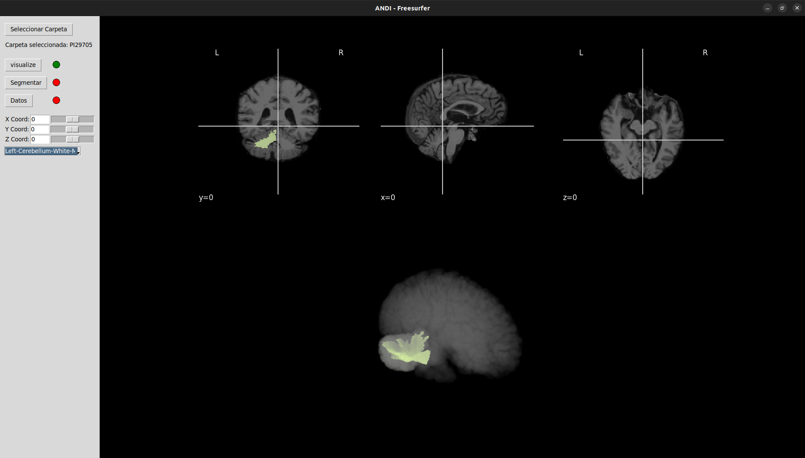

# MRI Segmentation and Radiomics Analysis with FreeSurfer and Pyradiomics


This repository contains code and tools for performing segmentations of magnetic resonance imaging (MRI) images using FreeSurfer and analyzing radiomic features using Pyradiomics.

## Description

In this project, we use FreeSurfer to perform segmentations of structures of interest in magnetic resonance imaging (MRI) images. Once the segmentations are obtained, we use Pyradiomics to extract a wide range of radiomic features. 
These are used to quantify and characterize regions of interest and provide additional information about the pathological features of the MRI images.

Here we can se a preview of the segmentation made to a specific subject.
| Complete Segmentation | Selected Segment |
|----------|----------|
|  |  |

## Contents
- [**Getting Started**](https://github.com/Danvalcor/ADNI-FreeSurfer-Segmentation/tree/main/Getting%20Started): This directory has basic jupiter notebooks to understand the fundamentals for visualizing volumes in python as well as generating segmentations using `FreeSurfer`.
- [**FreeSurfer - MRI Segmentation**](https://github.com/Danvalcor/ADNI-FreeSurfer-Segmentation/tree/main/FreeSurfer%20-%20MRI%20Segmentation): This directory contains scripts and configuration files for performing automatic segmentations of structures of interest in MRI images using FreeSurfer. As well as a step to step guide for generating a manual segmentation.
- [**Volume Visualization**](https://github.com/Danvalcor/ADNI-FreeSurfer-Segmentation/tree/main/FreeSurfer%20-%20MRI%20Segmentation): This directory contains scripts and configuration files for performing automatic segmentations of structures of interest in MRI images using FreeSurfer. As well as a step to step guide for generating a manual segmentation.
- [**Pyradiomics Radiomic Analysis Scripts**](https://github.com/Danvalcor/ADNI-FreeSurfer-Segmentation/tree/main/Segmentation%20Analysis): This directory contains scripts for performing radiomic analysis using Pyradiomics, including feature extraction and feature record generation.
- [**Integration.py**](https://github.com/Danvalcor/ADNI-FreeSurfer-Segmentation/blob/main/integration.py): A tkinter made app, that allows to integrate the contents of this respository. Allowing to visualize, segment and review segment data.
- [**Images**](https://github.com/Danvalcor/ADNI-FreeSurfer-Segmentation/tree/main/Images): A folder containing different pictures of the proyect.

🚨 **IMPORTANT:** It's important to note that some files make use of the helperFuns.py file, make sure to include it in the same workspace.

## Usage
To use this repository, follow the instructions provided in the documentation and execute the corresponding scripts in your working environment.

## Necesary libraries

This repositorie makes use of the followinf libraries:

* `os`
* `random`
* `numpy`
* `pandas`
* `nibabel`
* `tkinter`
* `sci`
* `matplotlib` (with `pyplot` and `colors`)
* `nilearn` (with `plotting` and `image`)
* `vtk` (for 3D visualization)

In the case of vtk, its highly recomended to build the library. Since `libvtkRenderingTk` might not be included. 
We recomend to use the following instructions

```bash
# Open the installation path of python or the active enviroment. (DCMAKE_INSTALL_PREFIX can also be used instead)
# It's usefull to use the 'which' command in an enviroment to find the path
cd ~/env/lib/python3.x/site-packages

# Clone VTK repository
git clone --branch v9.2.6 --recursive https://gitlab.kitware.com/vtk/vtk.git
cd vtk

# Create build path
mkdir build
cd build

# Configure compilation
cmake -DCMAKE_CXX_COMPILER=/usr/bin/g++-9 \
      -DCMAKE_C_COMPILER=/usr/bin/gcc-9 \
      -DBUILD_SHARED_LIBS=ON \
      -DVTK_BUILD_TESTING=OFF \
      -DVTK_PYTHON_VERSION=3 \
      -DCMAKE_BUILD_TYPE=Release \
      -DVTK_WRAP_PYTHON=ON \
      -DVTK_USE_TK=ON \
      -DVTK_MODULE_ENABLE_VTK_RenderingTk=YES \
      ..

# It's possible that you may need to install cmake, gcc-9, g++-9 as well as tcl-dev, tk-dev, libopengl-dev, libvtk9-dev and mesa-common-dev packages in order for it to work.

# Compilar e instalar
make -j$(nproc)
sudo make install
```
As well you must install FreeSurfer, to actually create the segmentations. In order to achieve this you may follow the next steps. 
* Get the latest package from the official [**website**](https://surfer.nmr.mgh.harvard.edu/fswiki/DownloadAndInstall). (At time of publishing it's **7.X.X**)
  <br>Take into consideration the required specifications:
  - Intel processor supporting AVX instructions
  - RAM: 8GB for recon, 16GB suggested for viewing graphics
  - Graphics card: 3D graphics card with its own graphics memory & accelerated OpenGL drivers
  - Size of installed image: 16GB
  - Typical size of a processed subject: 300MB
* You can install it from the terminal using the tar file. (make sure to have `tcsh` installed)
* You can manually check and verify available versions in the following [**page**](https://surfer.nmr.mgh.harvard.edu/fswiki/rel7downloads).
  
```bash
cd ~
# This is the 64 bit version for ubuntu 22.
wget ftp://surfer.nmr.mgh.harvard.edu/pub/dist/freesurfer/7.4.1/freesurfer-linux-ubuntu22_amd64-7.4.1.tar.gz
cd /usr/local/
sudo tar -xzvf ~/freesurfer-*.tar.gz

# Set up the global variables for free surfer
echo 'export FREESURFER_HOME="/usr/local/freesurfer"' >> ~/.bashrc
echo 'source $FREESURFER_HOME/SetUpFreeSurfer.sh' >> ~/.bashrc
source ~/.bashrc


# Clean the build
rm ~/freesurfer-*.tar.gz

# Activate the software.
# In order to achieve so, its very important to place the licence.txt in the following path.
sudo gedit /usr/local/freesurfer/license.txt

```


## Contributions

Contributions are welcome! If you would like to contribute, please open an issue to discuss your ideas or submit a pull request with your proposed changes.
